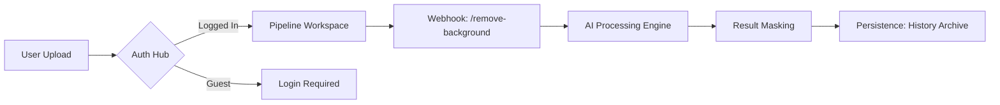

# 💎 SNAPCUT AI: THE ELITE MANIFESTO 💎
> **V3.0 Intelligence Hub — Surgical-Grade Background Removal Engine**

---

## ⚡ QUICK START: THE RUN COMMANDS
To bring the engine online, execute these tactical operations:

1.  📦 **Install Gear**: `npm install`
2.  🚀 **Ignition**: `npm run dev` (Local development)
3.  🏗️ **Fabrication**: `npm run build` (Production build)
4.  🔍 **Maintenance**: `npm run lint` (Code quality audit)

---

## 🏗️ THE ELITE TECH STACK [ETS]
*A high-performance architecture built for speed, scale, and surgical precision.*

| Segment | Technology | Notation |
| :--- | :--- | :--- |
| **Core Engine** | React 18 + Vite | 🔥 `VITE_REACT` |
| **Type Integrity** | TypeScript | 🛡️ `TS_SAFE` |
| **Interface Blueprint** | Tailwind CSS + Shadcn UI | 🎨 `TW_ELITE` |
| **Neural Motion** | Framer Motion | 🌀 `FM_FLUID` |
| **Neural Synapse (State)** | Zustand + React Context | 🧠 `ZN_SYNC` |
| **Data Backbone** | Supabase | 🏛️ `SUPA_BASE` |
| **Monetization Gate** | Razorpay Integration | 💳 `RP_PAY` |
| **Vector Icons** | Lucide React | 💠 `LCI_CORE` |

---

## 🔄 WORKFLOW ARCHITECTURE [WFA]

### 1. The Entrance (Landing/SEO)
- **Lazy Hydration**: Only loads components as you scroll (`LazySection`)
- **LCP Optimization**: Hero and Stats load at t=0 for instant visual feedback.

### 2. The Neural Pipeline (Image Processing)

### 3. The Subscription Shield
- **Free Tier**: Limited credits (local and DB tracking).
- **Pro Tier**: Managed via Razorpay webhook events; force-cached in `localStorage` for latency-free UI updates.

---

## 📡 API REGISTRY [APIR]

| Endpoint | Method | Purpose | Symbol |
| :--- | :--- | :--- | :--- |
| `/webhook/remove-background` | `POST` | Primary AI Removal Processor | 🧪 `AI_PROC` |
| `supabase.auth.*` | `RPC` | User Identity & Session Management | 🔑 `AUTH_KEY` |
| `razorpay.orders.*` | `POST` | Payment Gateway Initialization | 💳 `ORDER_GEN` |

---

## 🛠️ THE COMPONENT BLUEPRINT

### 🏗️ Layout Components
- `Navbar.tsx`: Floating tactical pill for navigation.
- `Footer.tsx`: Information anchor and legal registry.

### 🧪 Workspace Components
- `UploadZone.tsx`: The drop-zone handler for binary assets.
- `ProcessingView.tsx`: Real-time AI status updates (`React.memo` isolated).
- `ResultView.tsx`: The final artifact display with HD download controls.
- `HistoryView.tsx`: Archived project management and restoration.

---

## 📖 HOW TO USE: THE USER JOURNEY

1.  **LANDING** 🛩️: Enter the Intelligence Hub. Scroll to view capabilities.
2.  **UPLOAD** 📤: Click "Get Started" or drop an image into the Hero zone.
3.  **PROCESS** ⚙️: Wait for the surgical pixels analysis (Average 0.8s).
4.  **REFINEMENT** ✨: View the result over the tactical background grid.
5.  **EXPORT** 💾: Download as a high-quality transparent PNG artifact.
6.  **ARCHIVE** 📂: Revisit your history at any time from the dashboard.

---

## 🧰 USED TOOLS & LIBRARIES [UTL]
- **Sonner**: Micro-toasts for event feedback.
- **TanStack Query**: Asynchronous data synchronization.
- **Lucide**: Tactical vector iconography.
- **Embla Carousel**: Fluid motion for testimonials.
- **Zod**: Schema validation for data structures.

---

## 📝 MNEMONIC REMINDERS [MR]
- **L-C-P**: **L**azy-load, **C**ontex-memo, **P**erformance-containment (The SnapCut way).
- **S-C-A-N**: **S**elect, **C**ut, **A**rchive, **N**ext (The user workflow).

---

> **MANIFESTO STATUS: VERIFIED 🟢**
> **SYSTEM VERSION: 3.0.0 (INTELLIGENCE HUB)**
